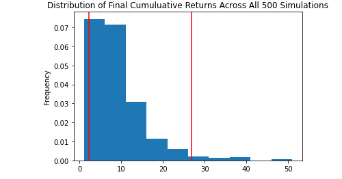

# Unit 5 - Financial Planning, API HW

## Commentary

This is about APIs, which are a power tool for pulling data. 

You'll be using python to pull data from several APIs.

## Assignment

Create two financial analysis tools.

1. personal finance planner - users can visualize their savings (stocks, cryptocurrencies).
   1. This is for comparing income vs expenses.
2. Retirement planning tool - use Alpaca API to get historical closing prices for a portfolio (stocks, bonds). Then, use Monte Carlo to project 30 years out. Then, initial investment, use the Monte Carlo data to calculate expected returns.
   1. This is forecasting.

### Files

* [Personal Finance Planner starter code](Starter_Code/financial-planner.ipynb)

* [MCForecastTools toolkit](Starter_Code/MCForecastTools.py)

### Resources

This homework will utilize two APIs:

* The **Alpaca Markets API** will be used to pull historical stocks and bonds information.  
  
* The **Alternative Free Crypto API** will be used to retrieve Bitcoin and Ethereum prices.

The documentation for these APIs can be found via the following links:

* [Free Crypto API Documentation](https://alternative.me/crypto/api/)

* [AlpacaDOCS](https://alpaca.markets/docs/)
---

## Instructions

### Part 1 - Personal Finance Planner

Create a personal finance planner application. Account for the assumptions:

* avg(household income)/member = $12,000

* Each member owns the following portfolio:

    * `1.2` BTC, `5.3` ETH, `50` SPY , `200` AGG

Add to the starter Jupyter notebook:

#### Collect Crypto Prices Using the `requests` Library

1. Create variables my_btc = 1.2, my_eth = 5.3

2. Use `requests`  to fetch the USD prices of for `BTC`, `ETH`, using the **Alternative Free Crypto API** endpoints in notebook.

3. Parse the JSON response to select only the crypto prices. Store each price in a variable.

    **Hint:** Be aware of the particular identifier for each cryptocurrency in the API JSON response - the bitcoin identifier is `1` whereas ethereum is `1027`.

4. Compute and print the portfolio value.

#### Collect Investments Data Using Alpaca: `SPY` (stocks) and `AGG` (bonds)

1. Create two variables my_agg = 200, my_spy = 50.

2. Create the Alpaca API object using `tradeapi.REST`.

3. Format the current date as ISO format. Change the date to the current.

4. Get the current closing prices for `SPY` and `AGG` using Alpaca's `get_barset()` function. Make results a DataFrame, and preview it.

5. ? Pick the `SPY` and `AGG` close prices from the Alpaca's `get_barset()` DataFrame response. Store as Python variables. Print the closing values for validation. Add limit=1000

6. Compute and print the USD value.

#### Savings Health Analysis

In this section, you will assess the financial health of the credit union's members.

1. Create a variable called `monthly_income` and set its value to `12000`.

2. To analyze savings health, create a DataFrame called `df_savings` with two rows. Store the total value in dollars of the crypto assets in the first row and the total value of the shares in the second row.

    **Hint:** The `df_savings` DataFrame should have one column named `amount` and two rows where `crypto` and `shares` are the index values: 
    
    

3. Use the `df_savings` DataFrame to plot a pie chart to visualize the composition of personal savings.

4. Use `if` conditional statements to validate if the current savings are enough for an emergency fund. An ideal emergency fund should be equal to three times your monthly income.

    * If total savings are greater than the emergency fund, display a message congratulating the person for having enough money in this fund.

    * If total savings are equal to the emergency fund, display a message congratulating the person on reaching this financial goal.

    * If total savings are less than the emergency fund, display a message showing how many dollars away the person is from reaching the goal.

### Part 2 - Retirement Planning

In this section, you will use the Alpaca API to fetch historical closing prices for a retirement portfolio and then Use the MCForecastTools toolkit to create Monte Carlo simulations to project the portfolio performance at `30` years. You will then use the Monte Carlo data to answer questions about the portfolio.

Follow the steps outlined in the starter notebook to complete the following:

#### Monte Carlo Simulation

1. Use the Alpaca API to fetch five years historical closing prices for a traditional `40/60` portfolio using the `SPY` and `AGG` tickers to represent the `60%` stocks (`SPY`) and `40%` bonds (`AGG`) composition of the portfolio. Make sure to convert the API output to a DataFrame and preview the output.

    > *Note*: As before, use the parameter `limit=1000` to ensure you get the most data possible back from the API. In Monte-Carlo Simulation, getting data as far back as possible matters, because if we simulate using only small amounts of data during a recent time when markets are booming, or instead falling precipitously, a Monte-Carlo Analysis will inadvertently extrapolate this temporary market movement too far into the future. Getting data over a longer time period mitigates this effect.

2. Configure and execute a Monte Carlo Simulation of `500` runs and `30` years for the `40/60` portfolio.

3. Plot the simulation results and the probability distribution/confidence intervals.

    
        
    

#### Retirement Analysis

1. Fetch the summary statistics from the Monte Carlo simulation results.

1. Given an initial investment of `$20,000`, calculate the expected portfolio return in dollars at the `95%` lower and upper confidence intervals.

2. Calculate the expected portfolio return at the `95%` lower and upper confidence intervals based on a `50%` increase in the initial investment.

### Optional Challenge - Early Retirement

The CTO of the Credit Union was really impressed with your work on this planner, but commented that `30` years seems like such a long time to wait to retire! The CTO starts wondering if the retirement plan could be adjusted to account for an earlier than normal retirement.

Try adjusting the portfolio to either include more risk (a higher stock than bond ratio) or to have a larger initial investment and rerun the retirement analysis to see what it would take to retire in `5` or `10` years instead of `30`!

---

### Hints and Considerations

* To allow for quicker work during the Monte Carlo simulation, start out by running `100` simulations for one year of returns, and when you have the code worked out, run the full `500` simulations for `30` years. 

* Remember to add the `.env` files to the `.gitignore` configuration to avoid exposing your API keys in your GitHub repository.

* A `.gitignore` file contains file names and extensions of files that you don't want pushed to your repository. For more information on how a `gitignore` works, you can read the documentation [here](https://docs.github.com/en/github/using-git/ignoring-files).
